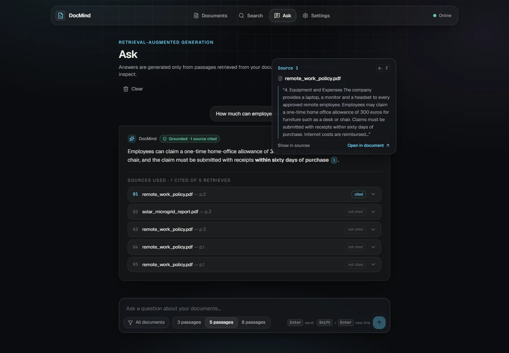
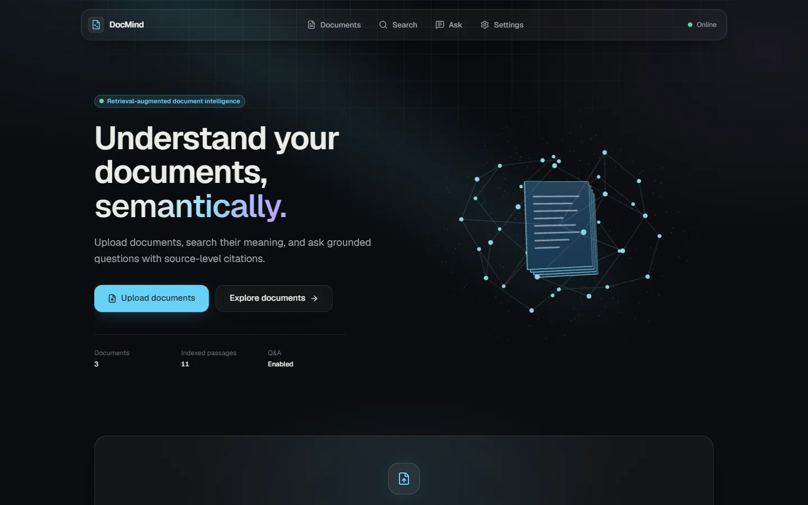
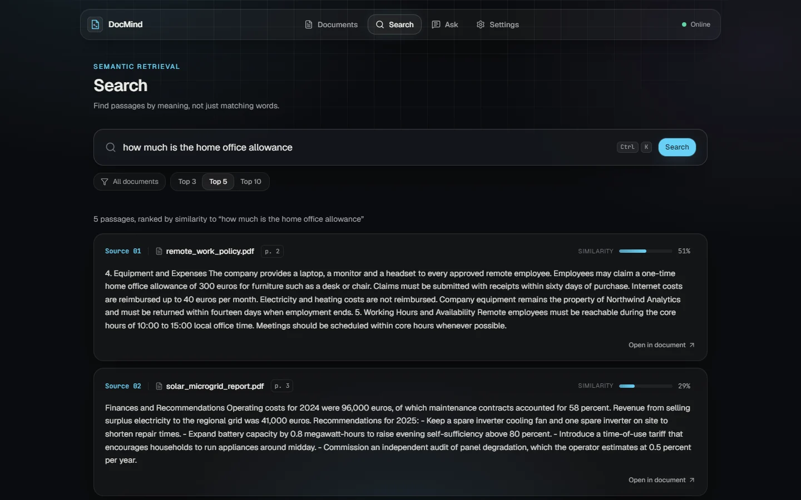
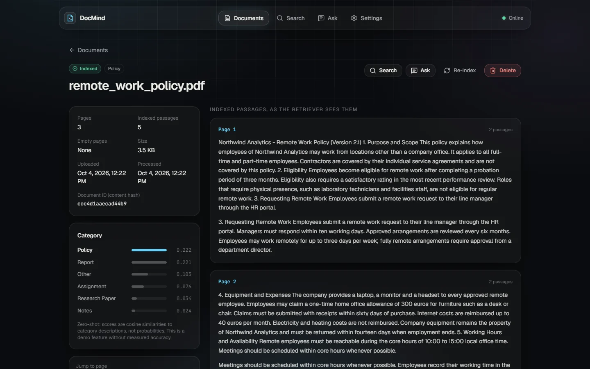
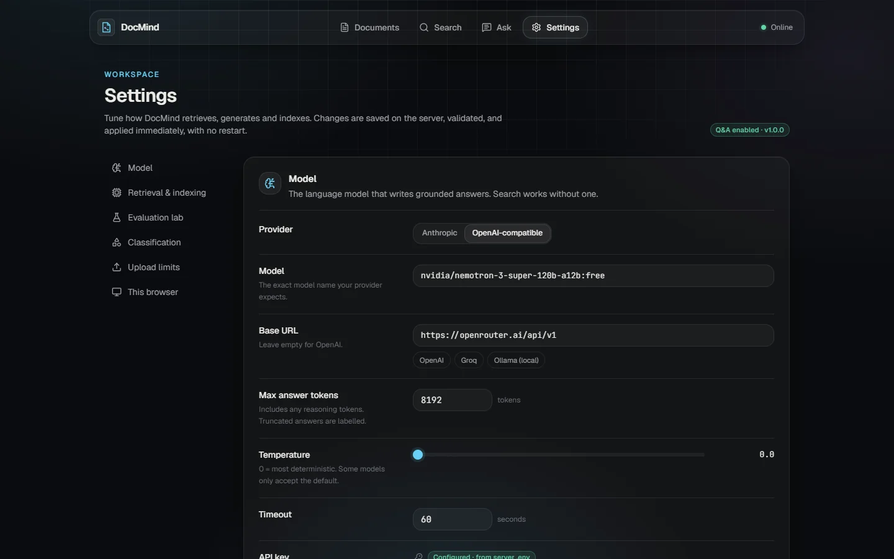

# DocMind

**Ask questions about your PDFs and get answers you can verify.** DocMind indexes your documents, finds passages by meaning, and answers questions using only those passages, with every claim linked to the exact document and page it came from. When the answer isn't in your documents, it says so.

It is a retrieval-augmented generation (RAG) system built from first principles, with no orchestration framework hiding the steps: PyMuPDF → sentence-aware chunking → MiniLM embeddings (ONNX Runtime) → FAISS → grounded prompt → LLM → citation validation. One container serves the FastAPI backend and the React interface, and it is designed to run for **$0**: free OpenRouter models, CPU-only inference, about 250 MB of RAM.



| | |
|---|---|
|  |  |
|  |  |

---

## Features

| | |
|---|---|
| **Upload & index** | Drag-and-drop PDFs with real upload progress. Processing runs on a background worker, so large files never block a request, and the UI shows live status (queued → processing → indexed). Page-by-page extraction, cleaning, sentence-aware chunks that never cross pages. Duplicates are detected by content hash; scanned, encrypted and oversized files fail with clear reasons. |
| **Semantic search** | Find passages by meaning, filter by document, see page numbers and cosine similarity (a similarity, not an "accuracy"). |
| **Grounded Q&A** | Answers are generated only from retrieved passages. Every `[n]` is a chip that opens the exact passage. The server decides grounding: *Grounded · N sources cited*, *Not found in your documents*, or *Could not be verified*. Hallucinated source numbers are flagged, and uncited replies are never presented as answers. |
| **Document library** | Status, page and chunk counts, warnings (e.g. empty pages), the passages exactly as the retriever sees them, zero-shot category, re-index and delete. |
| **Settings & evaluation lab** | Change the LLM provider, model, base URL, key (write-only) and limits, and test the connection, without restarting. Tune chunking with a live diagram, re-index in one click, and measure Hit@K / MRR to compare settings. |
| **Production basics** | Shared access token, upload/page/request limits, security headers and CSP, SSRF guard on UI-set endpoints, crash-safe storage with startup reconciliation, health check, graceful shutdown, structured error handling with no stack traces or provider bodies leaked. |

## How it works

```
                         ┌──────────────────────── one container ────────────────────────┐
Browser ── React SPA ──▶ │ FastAPI (/api)  ──▶  DocMindService                            │
  (served by FastAPI)    │                        │                                      │
                         │  upload ─▶ background worker: PyMuPDF ─▶ clean ─▶ chunk ─▶     │
                         │            embed (MiniLM, ONNX Runtime) ─▶ FAISS + registry    │
                         │                                                               │
                         │  question ─▶ embed ─▶ top-k ─▶ relevance floor + de-dup ─▶     │
                         │  numbered, sanitised context ─▶ LLM ─▶ citation check ─▶       │
                         │  grounded │ not found │ (retry once) ─▶ unverified            │
                         └──────────────────────────── DATA_DIR ──────────────────────────┘
```

**Retrieval.** Chunks of ~600 characters with whole-sentence overlap are embedded with `all-MiniLM-L6-v2` (384-d, L2-normalised) and stored in an exact `IndexFlatIP` FAISS index, so a score is the cosine similarity. Each chunk carries its document and page, so citations are exact.

**Generation.** Passages below a conservative relevance floor (`MIN_RELEVANCE=0.15`) and duplicate passages are dropped; if nothing is left, DocMind abstains without calling the LLM. The rest become numbered sources inside a `<sources>` block. Document text, including filenames, is sanitised so a PDF cannot close that block or forge a `[Source n]` header, and the system prompt treats sources as untrusted data.

**Verification.** Citation markers are parsed and checked against the sources actually sent. An answer that cites nothing it was given is retried once with a reminder (useful with routers such as `openrouter/free`, which pick a model per request). If it is still uncited, the user sees "could not be verified" and the raw reply only behind a disclosure.

Deeper dives: [Architecture](docs/ARCHITECTURE.md) · [RAG pipeline](docs/RAG_PIPELINE.md) · [Citations](docs/CITATIONS.md) · [Prompting](docs/PROMPTING.md).

## Tech stack

| Layer | Choices |
|---|---|
| AI pipeline | Python 3.11, PyMuPDF, `all-MiniLM-L6-v2` via **ONNX Runtime** + `tokenizers` (no PyTorch), FAISS, NumPy |
| LLM | Any OpenAI-compatible API (OpenRouter, OpenAI, Groq, Ollama) over HTTP, or the Anthropic SDK |
| Backend | FastAPI, Pydantic, Uvicorn |
| Frontend | React 19, TypeScript, Vite, Tailwind CSS v4, Radix primitives, Motion, TanStack Query, React Three Fiber (lazy-loaded hero only) |
| Quality | pytest, Vitest + Testing Library, an evaluation harness (Hit@K, Precision/Recall@K, MRR) |
| Delivery | Two-stage Dockerfile (Node build → Python runtime), one process, non-root |

**Why ONNX Runtime instead of PyTorch?** The model is the same and the vectors are identical (cosine 1.000000 against `SentenceTransformer.encode`, verified by a test), but measured on the development machine the process drops from 632 MB to 232 MB after embedding 300 chunks (peak 705 → 346 MB), the model loads in 3 s instead of 15 s, and the installed dependencies shrink from 1.3 GB to 0.4 GB. That is the difference between needing a paid instance and fitting a free one. Details: [docs/EMBEDDINGS.md](docs/EMBEDDINGS.md).

## Project structure

```
app/                  FastAPI app and the RAG pipeline
  api.py              routes (/api/*), auth, limits, security headers, SPA serving
  service.py          orchestration: upload → process (sync or background worker) → search → ask
  ingestion.py        PDF validation and page extraction (PyMuPDF)
  preprocessing.py    text cleaning          chunking.py   sentence-aware chunks
  embeddings.py       MiniLM on ONNX Runtime  vector_store.py  FAISS + metadata, atomic persistence
  retrieval.py        query → top-k           qa.py / prompts.py  grounding, citations, prompt
  llm.py              OpenAI-compatible + Anthropic clients, retries
  config.py           environment settings    runtime_settings.py  Settings-page overrides, SSRF guard
  registry.py         document registry (JSON) classifier.py  zero-shot / optional supervised
web/                  React + TypeScript UI (Vite); built to web/dist and served by FastAPI
evaluation/           evaluation harness, demo dataset and sample PDFs
tests/                pytest suite (API, pipeline, storage, security, background processing)
docs/                 topic documentation
main.py               CLI: api | ingest | train-classifier
Dockerfile, docker-compose.yml
```

## Run locally

Requirements: Python 3.11, Node 22+. No GPU, no PyTorch.

```bash
python -m venv .venv && source .venv/bin/activate     # Windows: .venv\Scripts\activate
pip install -r requirements-dev.txt
cp .env.example .env                                  # then add your OpenRouter key (see below)
cd web && npm ci && npm run build && cd ..
python main.py api                                    # UI + API on http://127.0.0.1:8000
```

The first start downloads the embedding model (~90 MB) into the Hugging Face cache; later starts take about a second.

**UI development:** run `python main.py api` and, in another terminal, `cd web && npm run dev` (http://localhost:5173, hot reload, proxies `/api`).

**Command line:** `python main.py ingest file1.pdf file2.pdf` indexes PDFs without the UI.

### Configuration

All configuration is environment variables (`.env` locally, the platform's secret store in production). The essentials:

| Variable | Purpose |
|---|---|
| `LLM_PROVIDER`, `LLM_MODEL`, `LLM_BASE_URL` | `openai`, `openrouter/free`, `https://openrouter.ai/api/v1` for the free setup |
| `LLM_API_KEY` | **Secret.** OpenRouter key from https://openrouter.ai/keys. Without it, search still works and Q&A is disabled. |
| `DOCMIND_API_TOKEN` | **Secret.** Shared access token for every `/api` route except `/api/health`. Required (≥ 24 characters) when `APP_ENV=production`. |
| `APP_ENV` | `production` (the Docker image's default) enforces the token and hides `/api/docs` |
| `DATA_DIR` | Where uploads, the index, the registry and saved settings live. Must be persistent in production. |
| `CHUNK_SIZE`, `CHUNK_OVERLAP`, `TOP_K`, `MIN_RELEVANCE` | Retrieval tuning (600 / 150 / 5 / 0.15); also editable on the Settings page |

Full reference: [docs/CONFIGURATION.md](docs/CONFIGURATION.md). Secrets never reach the browser bundle: the UI asks for the access token at runtime and keeps it in browser storage.

## Deploy for $0

The `Dockerfile` builds one image that serves everything on `$PORT`:

```bash
docker build -t docmind .
docker run -p 8000:8000 -v "$PWD/data:/app/data" \
  -e DOCMIND_API_TOKEN=... -e LLM_API_KEY=... \
  -e LLM_PROVIDER=openai -e LLM_MODEL=openrouter/free -e LLM_BASE_URL=https://openrouter.ai/api/v1 \
  docmind
```

or `docker compose up --build -d` with a `.env` file. On any host that runs a Dockerfile (Render, Hugging Face Spaces, Koyeb, Fly.io, a free VM):

1. Deploy from this repository's `Dockerfile`; set the secrets above in the platform's secret settings.
2. Health check path: `/api/health` (public, reveals no secrets). Allow ~90 s for the first start.
3. Run **one** instance (the index lives in process memory). 512 MB of RAM is enough for typical use.
4. Mount a **persistent volume at `/app/data`** if the platform offers one.

**Free-tier reality:** many free tiers have an ephemeral disk and sleep when idle. DocMind keeps working there, but every restart starts with an empty library: uploaded PDFs, the FAISS index and the registry all live in `DATA_DIR`. The app is crash-safe and recovers cleanly from an empty or reset directory, but it cannot keep data on storage that the platform deletes. Step-by-step guide and trade-offs: [docs/DEPLOYMENT.md](docs/DEPLOYMENT.md) · [docs/DOCKER.md](docs/DOCKER.md).

## Security

- Token auth with constant-time comparison; production refuses to start without a strong token. CORS is off by default and accepts exact origins only.
- Upload limits checked before the body is read; PDF magic bytes, page limits, encrypted/scanned PDFs handled; files stored under content hashes (no path traversal).
- Untrusted document text is sanitised before it enters the prompt; answers are rendered as text from a tiny Markdown subset (no links, images or HTML).
- LLM keys are write-only in the UI, the environment key is never sent to an endpoint changed from the UI, and UI-set base URLs must be public HTTPS hosts in production (SSRF guard).
- Logs record sizes and timings, never questions, document text, prompts, answers, tokens or keys; clients never see stack traces or provider error bodies.

Details and known gaps: [docs/SECURITY.md](docs/SECURITY.md).

## Testing and evaluation

```bash
pytest                                     # backend: API, pipeline, storage, security, background worker
cd web && npm test && npm run typecheck    # frontend: rendering safety, citations, grounding states
python evaluation/evaluate.py              # retrieval metrics on the demo dataset
```

220 backend and 40 frontend tests pass. Retrieval on the bundled demo set (20 questions over 3 short fictional PDFs, written by the author, so optimistic and useful only for **comparing settings**):

| Chunk size / overlap | Hit@1 | Hit@3 | Hit@5 | MRR |
|---|---|---|---|---|
| **600 / 150 (default)** | 0.85 | 1.00 | 1.00 | 0.917 |
| 800 / 150 (previous default) | 0.70 | 0.95 | 1.00 | 0.838 |
| 1000 / 150 | 0.65 | 0.95 | 1.00 | 0.812 |

A live end-to-end run against `openrouter/free` (8 questions across 4 routed models) answered every factual question correctly with the right page cited and abstained on every unanswerable one. That is a spot check, not a benchmark: the QA evaluation (`--qa`) has not been run at scale. See [docs/EVALUATION.md](docs/EVALUATION.md).

## Known limitations

- **Persistence on free tiers** depends on the platform offering a volume (see above). There is no external storage by design.
- **Single process.** One worker holds the index; there is no horizontal scaling and no job queue beyond the in-process background worker.
- **Shared token, not user accounts;** no built-in rate limiting (free models are rate-limited by the provider).
- **PDF only, no OCR;** tables and multi-column layouts become plain text.
- **Dense retrieval only** with a small English-focused model; no BM25 hybrid or re-ranker.
- **Citation checks are structural.** DocMind verifies that cited sources exist and were provided, not that each passage logically supports the claim, and it cannot tell true document content from planted false content.
- **Unverified here:** the Docker build (no Docker on the development machine) and the Anthropic provider with a live key.

## Roadmap

- Hybrid retrieval (BM25 + dense) and an optional cross-encoder re-ranker, measured with the evaluation lab.
- Claim-level support checking (NLI) for citations.
- OCR for scanned PDFs.
- Optional object-storage backup of `DATA_DIR` for hosts without volumes.
- Streaming answers.

## Documentation

| | |
|---|---|
| Run & operate | [Getting started](docs/GETTING_STARTED.md) · [Configuration](docs/CONFIGURATION.md) · [Deployment](docs/DEPLOYMENT.md) · [Docker](docs/DOCKER.md) · [Troubleshooting](docs/TROUBLESHOOTING.md) |
| How it works | [Architecture](docs/ARCHITECTURE.md) · [RAG pipeline](docs/RAG_PIPELINE.md) · [Embeddings](docs/EMBEDDINGS.md) · [Vector search](docs/VECTOR_SEARCH.md) · [Retrieval](docs/RETRIEVAL.md) · [Prompting](docs/PROMPTING.md) · [LLM integration](docs/LLM_INTEGRATION.md) · [Citations](docs/CITATIONS.md) |
| Quality & safety | [Evaluation](docs/EVALUATION.md) · [Security](docs/SECURITY.md) |
| Interface | [Frontend](docs/FRONTEND.md) · [Design system](docs/DESIGN_SYSTEM.md) |
| Reference | [HTTP API](docs/API.md) · [Contributing](docs/CONTRIBUTING.md) · [Project guide](PROJECT_GUIDE.md) |

## Author

**Ranjan Verma** · [GitHub](https://github.com/ranjanvrma)
